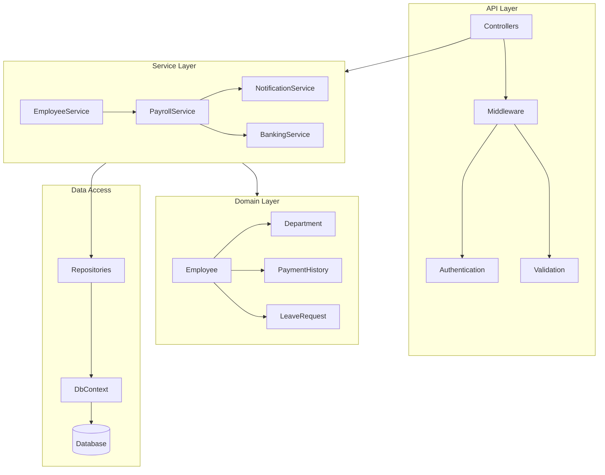

[⬅️ Back to Documentation](../../README.md)

# Component Level Architecture

## Key Components
- **API Layer**: Controllers, Middleware, Authentication
- **Service Layer**: Business logic orchestration
- **Domain Layer**: Core business entities and rules
- **Data Access**: Repository implementations