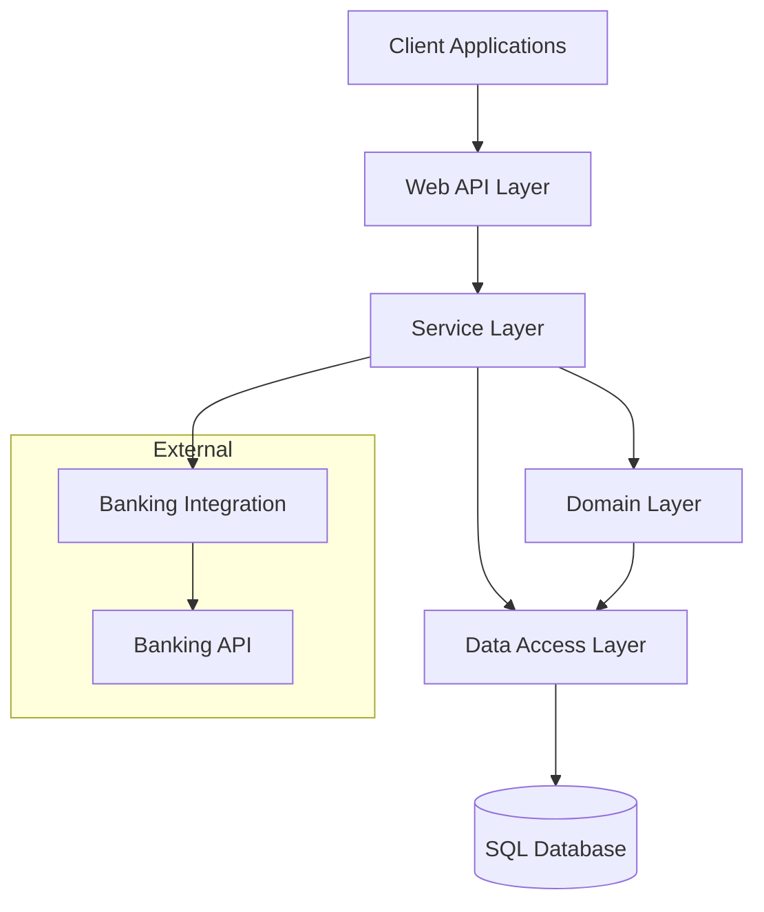

[⬅️ Back to Documentation](../../README.md)

# High Level Architecture

## Components
- **Client Applications**: Web and Mobile clients
- **Web API Layer**: REST API endpoints
- **Service Layer**: Business logic and orchestration
- **Domain Layer**: Core business rules and entities
- **Data Access Layer**: Database operations
- **Banking Integration**: External payment processing