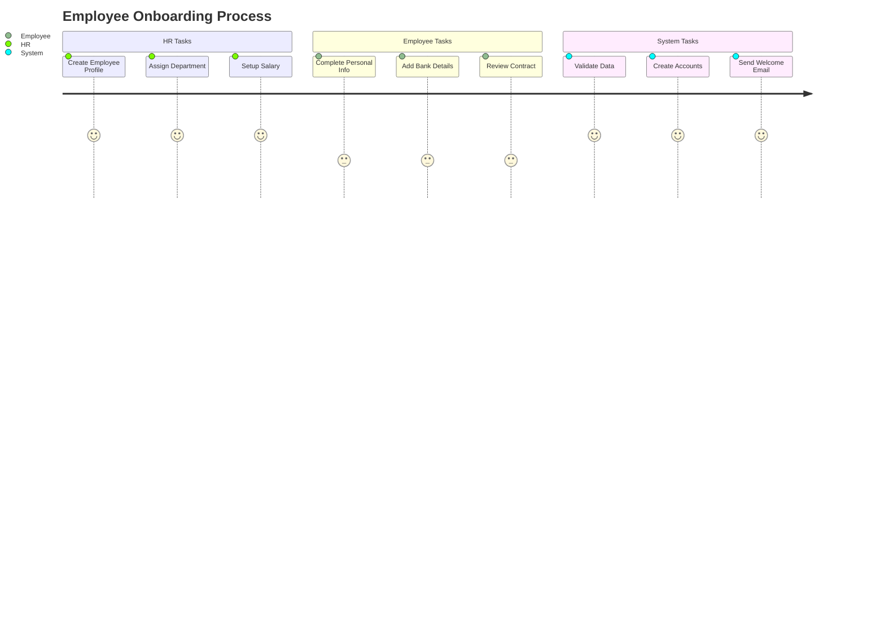
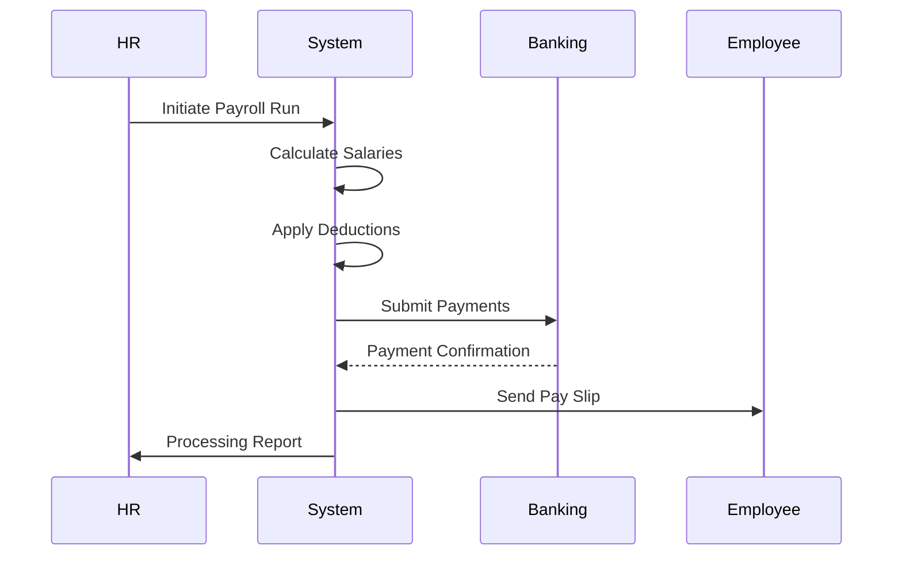
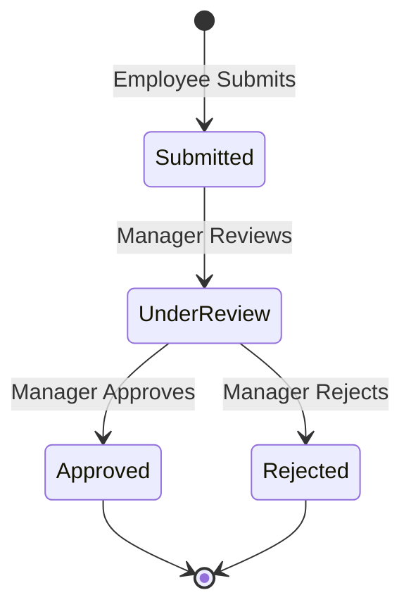

[⬅️ Back to Documentation](../../README.md)

# User Journeys

## Employee Onboarding Journey

```mermaid
journey
    title Employee Onboarding Process
    section HR Tasks
        Create Employee Profile: 5: HR
        Assign Department: 5: HR
        Setup Salary: 5: HR
    section Employee Tasks
        Complete Personal Info: 3: Employee
        Add Bank Details: 3: Employee
        Review Contract: 3: Employee
    section System Tasks
        Validate Data: 5: System
        Create Accounts: 5: System
        Send Welcome Email: 5: System
```

## Payroll Processing Journey

```mermaid
sequenceDiagram
    participant HR
    participant System
    participant Banking
    participant Employee

    HR->>System: Initiate Payroll Run
    System->>System: Calculate Salaries
    System->>System: Apply Deductions
    System->>Banking: Submit Payments
    Banking-->>System: Payment Confirmation
    System->>Employee: Send Pay Slip
    System->>HR: Processing Report
```

## Leave Request Flow

```mermaid
stateDiagram-v2
    [*] --> Submitted: Employee Submits
    Submitted --> UnderReview: Manager Reviews
    UnderReview --> Approved: Manager Approves
    UnderReview --> Rejected: Manager Rejects
    Approved --> [*]
    Rejected --> [*]
```